# DeutschScene AI

## What is DeutschScene AI?

DeutschScene AI is a full-stack web application for learning German from real documents and AI-generated practice material. It combines document import, vocabulary extraction, flashcards, quizzes, pronunciation feedback, text-to-speech, lesson summaries, and progress tracking in one authenticated learning workspace.

Upload a PDF or image, let Gemini extract useful vocabulary and lesson content, then review it through flashcards, quizzes, pronunciation exercises, dialogue scenes, and dashboards.

The project is designed as a personal learning platform for A1/A2 German learners, with a React frontend and a secured Express API.

## Features

- KI-gestützte Dokumentanalyse für PDFs und Bilder.
- Wortschatz-Extraktion mit Artikeln, Übersetzungen, Themen und Beispielen.
- Lernkarten mit Schwierigkeitsbewertung für Wiederholungen.
- Quiz-Generierung für Deutsch-Französisch, Französisch-Deutsch, Artikel und Hörübungen.
- Aussprachetraining mit Spracherkennung und KI-Feedback.
- Hochwertige deutsche Text-to-Speech-Ausgabe mit Browser-Fallback.
- KI-generierte Zusammenfassungen und deutsche Grundlagen.
- Dialogfilm-Modus für szenenbasiertes Sprachtraining.
- AI Gespräch mit niveauangepassten deutschen Antworten, Korrekturen, Übersetzungen und nützlichem Wortschatz.
- Authentifizierte Benutzerkonten mit JWT und bcrypt-Passwort-Hashing.
- Lernübersicht mit neuen Wörtern, Wiederholungen, Statistiken und schwierigen Bereichen.
- Produktionsorientiertes Backend: Rate Limiting, Helmet, CORS, Logging und Docker-Support.

## Demo

Local development:

- Frontend: `http://localhost:5173`
- Backend API: `http://localhost:3001/api`
- Health check: `http://localhost:3001/api/health`

Run the full stack with Docker:

```bash
docker-compose up -d
```

Or run each service manually from the `backend` and `frontend` folders as described in the installation section.

## Screenshots

### Authentication

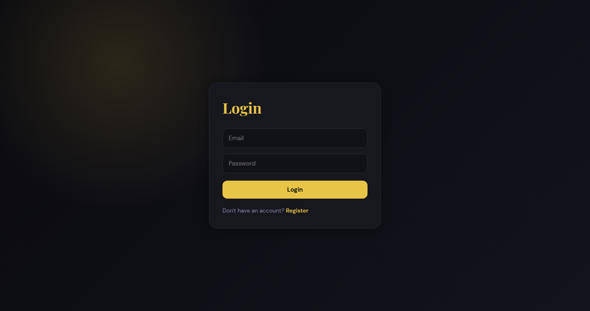

### Dashboard

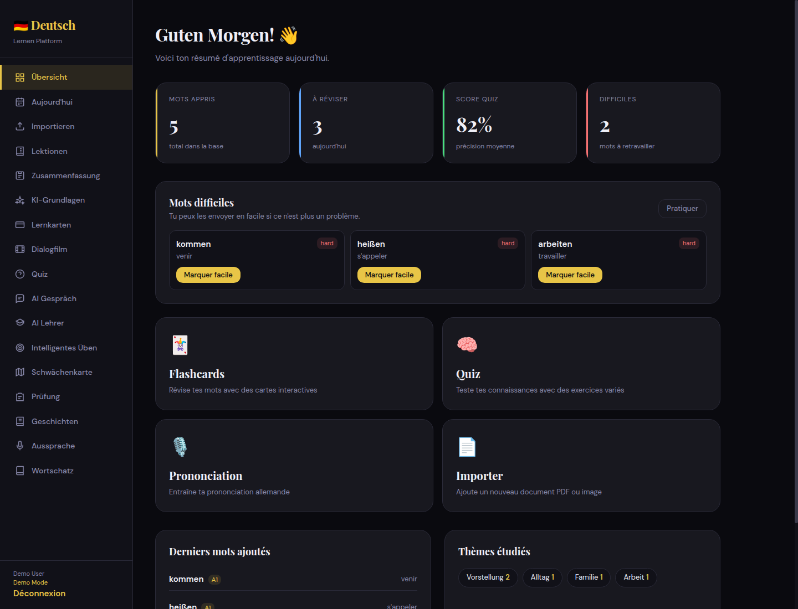

### Upload

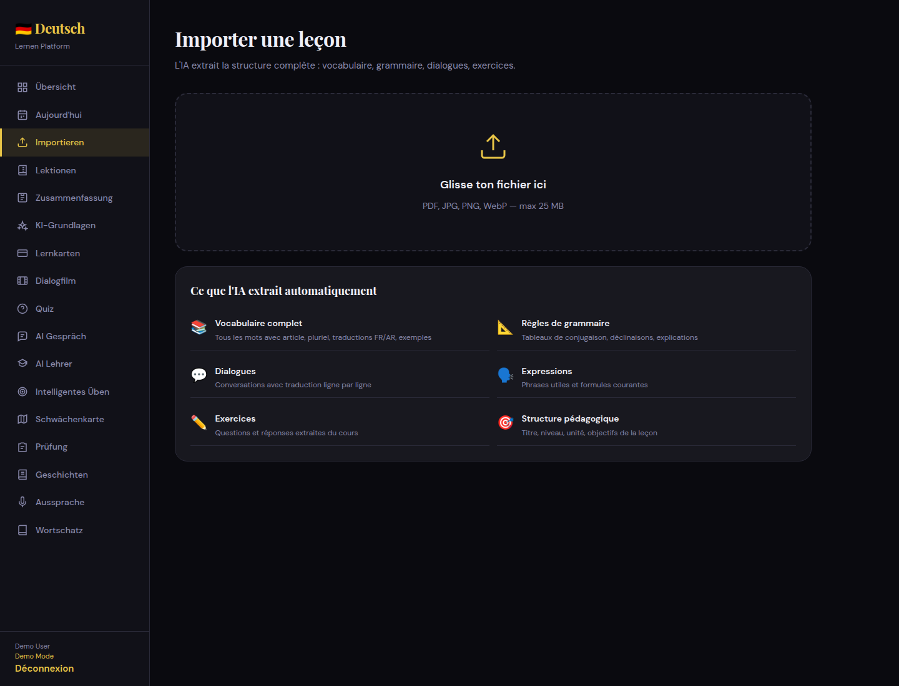

### Lessons

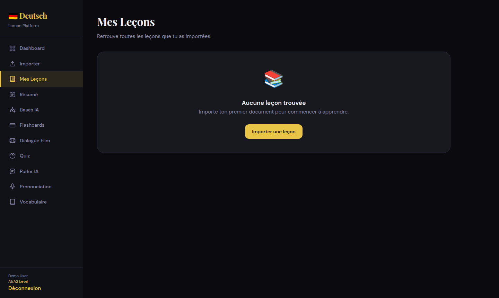

### Summary

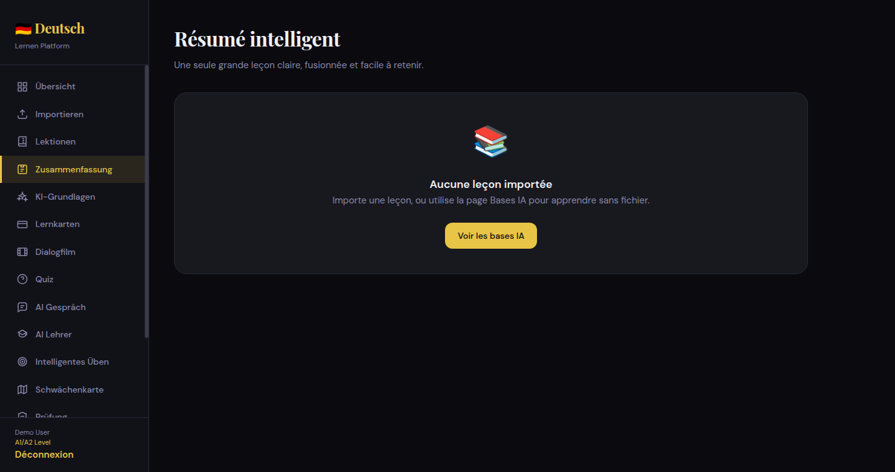

### AI Basics

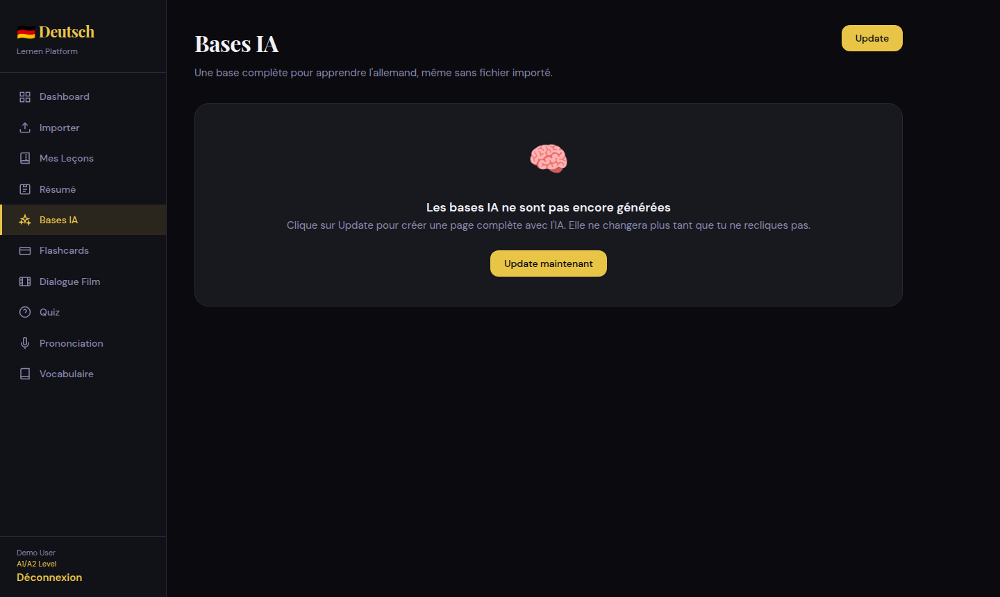

### Flashcards

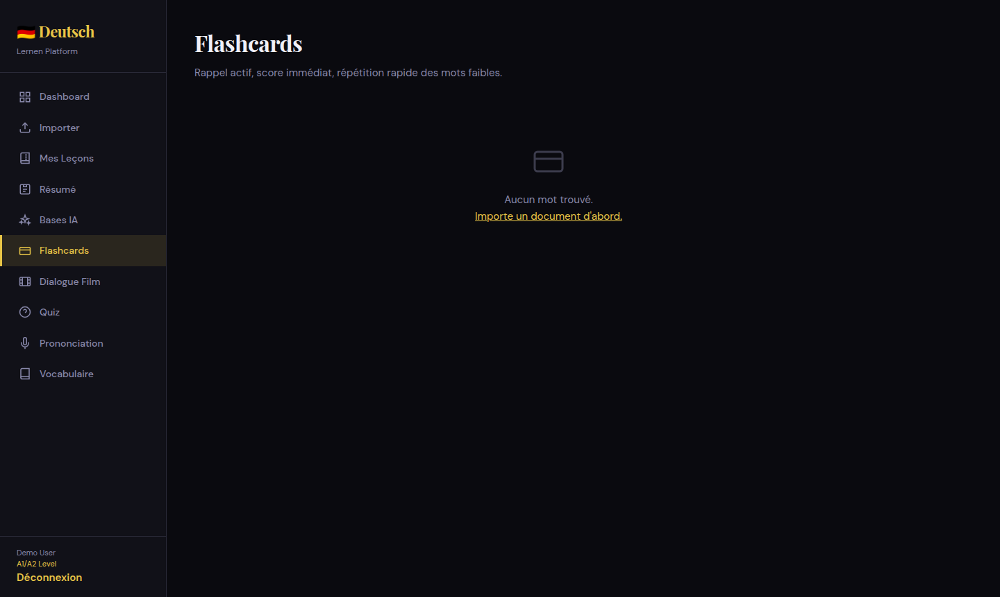

### Dialogue Film

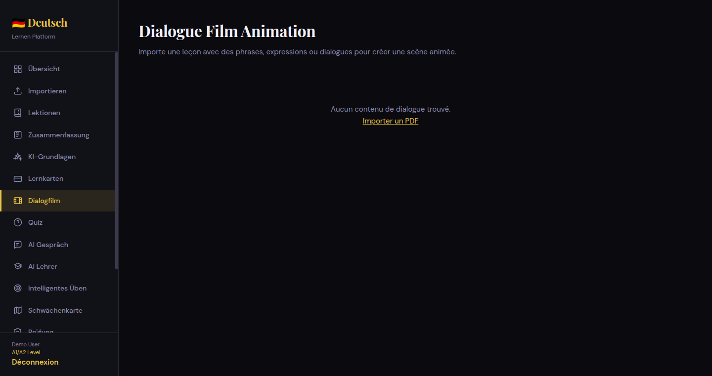

### Quiz

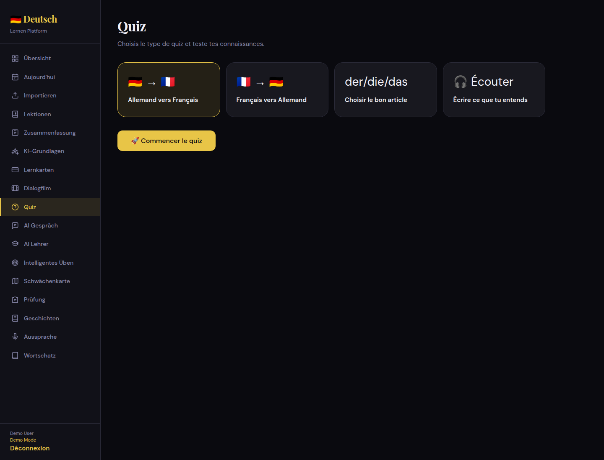

### AI Gespräch

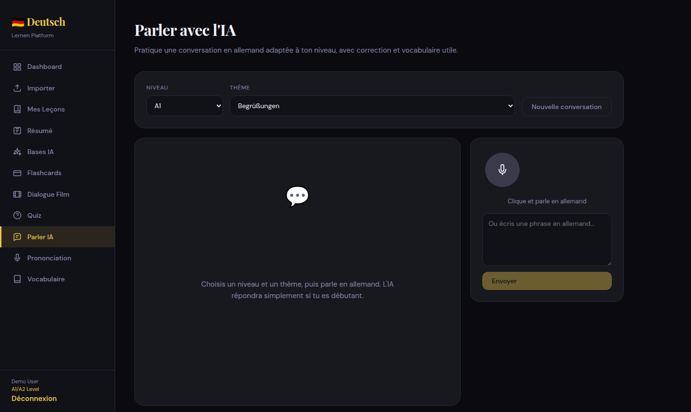

### Pronunciation

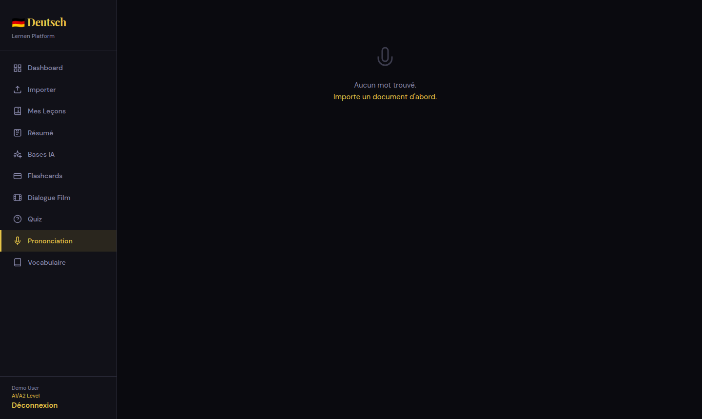

### Vocabulary

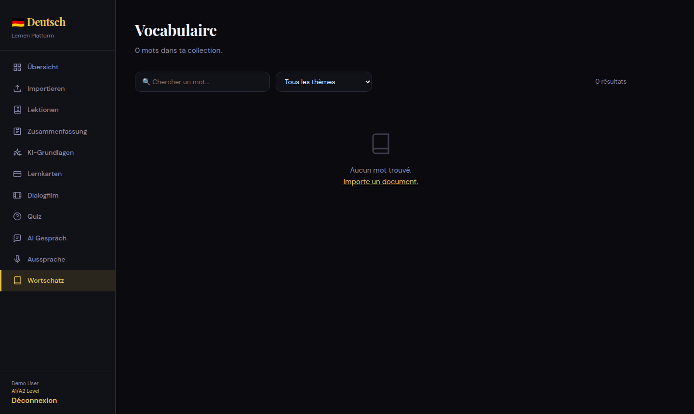

## How it works

1. The user signs in or creates an account.
2. The frontend sends authenticated requests to the Express API.
3. Uploaded documents are parsed and analyzed by Gemini.
4. Extracted lessons and vocabulary are stored in the local SQL database.
5. The learner reviews the material through flashcards, quizzes, pronunciation checks, summaries, and dialogue scenes.
6. Progress routes aggregate learning activity for the dashboard and review queue.

Main API areas:

- `POST /api/auth/register`
- `POST /api/auth/login`
- `GET /api/auth/me`
- `POST /api/upload`
- `GET /api/upload/lessons`
- `GET /api/upload/summary`
- `GET /api/upload/basics`
- `GET /api/upload/dialogue-film`
- `GET /api/words`
- `GET /api/quiz/generate`
- `POST /api/quiz/answer`
- `POST /api/pronunciation/check`
- `POST /api/conversation/practice`
- `POST /api/tts/speak`
- `GET /api/progress/dashboard`

## Tech Stack

Frontend:

- React 18
- Vite
- React Router
- Axios
- Framer Motion
- Web Speech API

Backend:

- Node.js
- Express
- Gemini API
- sql.js / local SQL database
- JWT authentication
- bcryptjs
- Multer
- pdf-parse
- Winston
- Helmet
- express-rate-limit

Tooling and deployment:

- Docker
- Docker Compose
- Jest
- Supertest
- ESLint

## Installation

Prerequisites:

- Node.js 18+
- npm
- A Gemini API key
- Chrome or Edge for the best speech recognition support

Clone the repository:

```bash
git clone https://github.com/karamu-ser/DeutschScene-AI.git
cd DeutschScene-AI
```

Install and run the backend:

```bash
cd backend
cp .env.example .env
npm install
npm run dev
```

Install and run the frontend in another terminal:

```bash
cd frontend
npm install
npm run dev
```

Open the app:

```text
http://localhost:5173
```

Run tests:

```bash
cd backend
npm test
```

Build the frontend:

```bash
cd frontend
npm run build
```

Run with Docker:

```bash
cp .env.example .env
# Edit .env and set GEMINI_API_KEY before starting the stack.
docker-compose up -d --build
```

## Environment Variables

Backend variables in `backend/.env`:

```env
NODE_ENV=development
PORT=3001
FRONTEND_URL=http://localhost:5173

JWT_SECRET=replace-with-a-long-random-secret
JWT_EXPIRY=7d

GEMINI_API_KEY=your_gemini_api_key
GEMINI_MODEL=gemini-3.1-flash-lite

LOG_LEVEL=info

API_RATE_LIMIT_MAX=1000
AUTH_RATE_LIMIT_MAX=100

HTTPS_ENABLED=false
HTTPS_KEY_PATH=/path/to/key.pem
HTTPS_CERT_PATH=/path/to/cert.pem
```

Optional backend variables:

```env
DB_PATH=./database.db
GEMINI_TTS_MODEL=gemini-2.5-flash-preview-tts
GEMINI_TTS_MODELS=gemini-2.5-flash-preview-tts
GEMINI_TTS_LENA_VOICE=Kore
GEMINI_TTS_SAMIR_VOICE=Puck
GEMINI_TTS_DEFAULT_VOICE=Kore
```

Frontend variables in `frontend/.env`:

```env
VITE_API_URL=http://localhost:3001/api
```

Security notes:

- Never commit `.env` files.
- Keep `GEMINI_API_KEY` on the backend only.
- Use a long, random `JWT_SECRET` in production.
- Set `FRONTEND_URL` to the deployed frontend origin to keep CORS strict.

## Roadmap

### Short Term

- Deploy a public demo.
- Add preview media for the main learning flows.
- Expand test coverage for the core API routes.

### Learning Experience

- Add Anki export for vocabulary and flashcards.
- Improve spaced repetition scheduling.
- Add richer listening comprehension exercises.
- Add PWA/offline learning support.

### Product

- Add dark/light theme preferences.
- Add import history.
- Add collection sharing.
- Add user profile and learning goals.

## Contributing

Contributions are welcome.

1. Fork the repository.
2. Create a feature branch.
3. Install dependencies for both `backend` and `frontend`.
4. Make focused changes with clear commits.
5. Run tests and relevant builds before opening a pull request.

Recommended checks:

```bash
cd backend
npm test

cd ../frontend
npm run build
```

## License

This project is licensed under the MIT License. See [LICENSE](LICENSE) for details.
